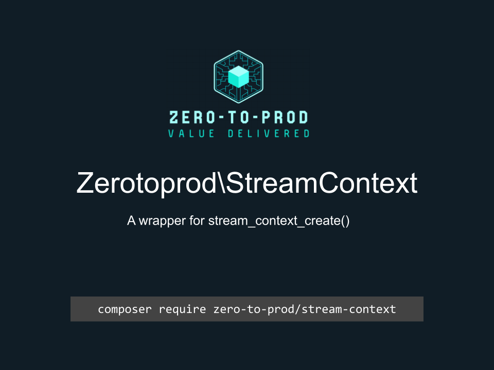

# Zerotoprod\StreamContext



[](https://github.com/zero-to-prod/stream-context)
[](https://github.com/zero-to-prod/stream-context/actions)
[](https://github.com/zero-to-prod/stream-context/actions)
[](https://packagist.org/packages/zero-to-prod/stream-context/stats)
[](https://packagist.org/packages/zero-to-prod/stream-context)
[](https://github.com/zero-to-prod/stream-context)
[](https://github.com/zero-to-prod/stream-context/blob/main/LICENSE.md)
[](https://hitsofcode.com/github/zero-to-prod/stream-context/view?branch=main)

## Contents

- [Introduction](#introduction)
- [Requirements](#requirements)
- [Installation](#installation)
- [Usage](#usage)
    - [Supported Protocols](#supported-protocols)
- [Local Development](./LOCAL_DEVELOPMENT.md)
- [Contributing](#contributing)

## Introduction

A wrapper for the [`stream_context_create()`](https://www.php.net/manual/en/function.stream-context-create.php) method.

It provides classes that define all the options for this method.

## Requirements

- PHP 7.1 or higher.

## Installation

Install `Zerotoprod\StreamContext` via [Composer](https://getcomposer.org/):

```bash
composer require zero-to-prod/stream-context
```

This will add the package to your project’s dependencies and create an autoloader entry for it.

## Usage

```php
use Zerotoprod\StreamContext\StreamContext;
use Zerotoprod\StreamContext\DataModels\Options;
use Zerotoprod\StreamContext\DataModels\Http;

$client = stream_socket_client(
    'ssl://neverssl.com:443',
    $error_code,
    $error_message,
    30,
    STREAM_CLIENT_CONNECT,
    StreamContext::create([
        Options::http => [
            Http::method => 'GET',
            Http::header => "Accept-language: en\r\n"."Cookie: foo=bar",
            Http::proxy => 'proxy'
        ],
        ['options']
    ])->context
);

fclose($client);
```

### Supported Protocols

- HTTP: Customize request methods, headers, user-agent, and more.
- FTP: Manage file transfers with options like overwrite, resume position, and proxy.
- SSL: Configure SSL/TLS options including peer verification, certificates, and more.
- Phar: Set options like compression and metadata for Phar archives.
- Zip: Handle encrypted Zip files with password options.
- Zlib: Control compression levels for zlib streams.

## Contributing

Contributions, issues, and feature requests are welcome!
Feel free to check the [issues](https://github.com/zero-to-prod/stream-context/issues) page if you want to contribute.

1. Fork the repository.
2. Create a new branch (`git checkout -b feature-branch`).
3. Commit changes (`git commit -m 'Add some feature'`).
4. Push to the branch (`git push origin feature-branch`).
5. Create a new Pull Request.
